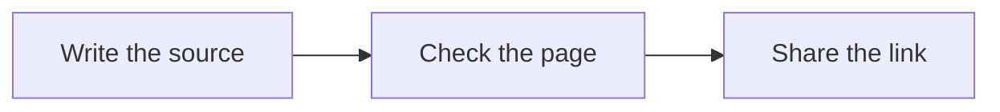

# Write less layout. Explain more clearly.

A good write-up should be easy to scan and worth reading. Most of the time, headings, short paragraphs, and one useful example are enough.


Start with Markdown. Add a diagram or a small visual block only when it makes the point clearer.


## Choose the smallest useful view



Say what you recommend and why. Keep the details close to the example they explain.


A tree shows ownership. A diagram shows movement. A diff shows what changes.



| What you need to explain | A useful starting point |
| --- | --- |
| The order of a few calls | A short call tree |
| Who passes information to whom | A sequence diagram |
| A change to an existing design | A diff |
| Two choices | A short table or two cards |
| An interactive idea | One focused HTML page |

## Show the flow



The source stays on disk. The shared page is the easy-to-read copy.

## Show who does what

```text
publishWriteUp
  checkService
  uploadSource
  verifyPage
  saveReceipt
  returnLink
```

## Show the change

```diff
 writeContent
-  writePageLayout
-  copyStyles
+  chooseUsefulBlocks
   checkResult
   shareLink
```

## Keep code copyable

```ts
function chooseView(needsInteraction: boolean) {
  return needsInteraction ? "html" : "markdoc";
}
```


The answer, the evidence that matters, and the next step. Keep credentials and personal data out. A link is easy to open, but anyone who gets it can read the page.



1. Lead with the answer.
2. Pick the smallest view that helps.
3. Check the result on a phone as well as a larger screen.



Don't use jargon; speak coherently; write simply and concisely, like one human talking to another.

