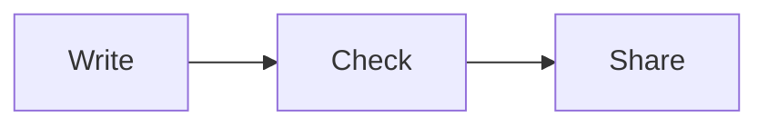

# Document format

Ordinary Markdown and Markdoc use the same renderer. Start with Markdown. Add a block only when it makes the document easier to read.

## Small reusable blocks

```markdoc

Keep the current service. Improve the part that needs work.

```

`title` is optional. `tone` is `note`, `warning`, or `success`.

```markdoc


Write content and layout together.


Write the content. Let the service handle the layout.


```

`count` is 2 or 3. Columns stack on phones. Keep cards short; put longer explanations in the main text.

```markdoc

Extra detail goes here, out of the way of the main explanation.



1. Write the source.
2. Check the page.
3. Share the link.

```

## Useful views

Use fenced `text` for a call tree, file tree, or pseudocode. Use `diff` for changes, and the real language name (`ts`, `tsx`, `python`, `bash`, and so on) for code. Fence contents stay literal, so code examples can contain Markdoc tags.

````markdown
```text
saveDocument
  checkContent
  storeSource
  returnLink
```


````

Mermaid also supports sequence and state diagrams. Use short labels and few nodes. The page includes a source disclosure below each rendered diagram. Invalid diagrams show their source instead of a blank box.

Markdown headings, lists, quotes, tables, links, and images work. Use images uploaded to this service, with `/ID/content` as the image URL (especially for SVG, whose main link opens a viewer). Off-site images, fonts, and scripts are blocked to avoid third-party requests. Ordinary external text links work without sending the artifact URL as a referrer.

Only the five blocks above are supported. There are no imports, expressions, custom functions, file includes, or arbitrary HTML in Markdown. Raw HTML is displayed as text. Unknown tags and unsupported attributes are rejected.

For several related pages, see [COLLECTIONS.md](COLLECTIONS.md). It explains shared navigation, links by page key, and stable edits.

## Full HTML, when needed

Use `--type html` for one focused visual page. Include `<!doctype html>`, UTF-8, a viewport tag, clear headings, responsive CSS, and a title. Keep styles and any scripts inline. Use system fonts. Make controls work by keyboard and label them. Keep prose simple and concise. Support light and dark colors with `prefers-color-scheme` when useful. The outer viewer has a saved theme choice, but custom HTML retains its own styling.

The page runs in an isolated frame. Its inline scripts can update its own document, but it cannot fetch data, read the site's storage, submit forms, open popups, load remote libraries, or embed other frames. Do not add `allow-same-origin` or work around these restrictions. Prefer Markdown and the built-in blocks unless custom interaction or layout is the point.

A share link opens the viewer. `/ID/content` serves the original content with isolation headers; `/ID/download` downloads the source. All responses carry no-index headers.
